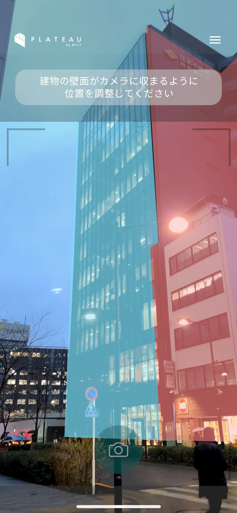

# PLATEAU-SNAP-App

## 1. 概要

本リポジトリでは、2024 年度の Project PLATEAU で開発した「PLATEAU-SNAP-App」のソースコードを公開しています。  
「PLATEAU-SNAP-App」は、デジタルツインの実現に向けたクラウドソーシング型 3D 都市モデル作成システム (PLATEAU SNAP) のモバイルアプリケーションです。

## 2. PLATEAU-SNAP-Appについて

スマートフォンで撮影した画像をもとに 3D 都市モデルの建物地物のテクスチャ(地物の外観)を抽出・生成し、3D 都市モデルのデータベースに登録・蓄積可能なツール「PLATEAU SNAP」を開発しました。

本システムは、同ツールのフロントエンドとし機能し、スマートフォンの位置や姿勢を高精度で推定するVPS機能に加えて、撮影可能な建物の面をカメラ映像上にAR表示する機能や撮影した画像の品質を評価する機能、撮影画像と面情報をアップロードする機能を提供します。バックエンドのリポジトリは 「[PLATEAU-SNAP-Server](https://github.com/Project-PLATEAU/PLATEAU-SNAP-Server)」にて管理されています。バックエンドの詳細については、そちらのリポジトリをご確認ください。

## 3. 利用手順

本システムの構築手順及び利用手順については[操作マニュアル](https://project-plateau.github.io/PLATEAU-SNAP-App/index.html)を参照してください。

## 4. システム概要

| 機能名                 | 機能説明                                                                             |
| ---------------------- | ------------------------------------------------------------------------------------ |
| VPS機能 | カメラ映像を解析し、周囲の建物やランドマークを基にカメラの位置や向きを高精度に推定する機能 |
| ARでの面表示機能 | クラウドから撮影可能な建物の面を取得し、カメラ映像上にAR表示する機能 |
| 建物撮影機能 | ARで表示された建物の面を選択し、その面の画像を撮影する機能 |
| 品質評価機能 | 撮影した画像がテクスチャ素材として適切かどうか評価する機能 |
| 画像アップロード機能 | 撮影画像と貼り付け先の面情報をデータベースにアップロードする機能 |

## 5. 利用技術

| 項目 | 名称 | バージョン | 内容 |
|---|---|---|---|
| 開発プラットフォーム | Unity | [2022.3.44f1](https://docs.unity3d.com/ja/2022.3/Manual/) | モバイルアプリの開発に使用 |
| 使用言語 | C# | [9.0](https://docs.unity3d.com/ja/2022.3/Manual/CSharpCompiler.html) | Unityのサポート言語 |

### Unity関連のパッケージ

- ランタイム
  - ランタイムの実行に必要なUnityの依存パッケージです。

| 名称 | バージョン | 内容 |
|-----|-------|-------|
| [PLATEAU.SNAP.Server](https://github.com/Project-PLATEAU/PLATEAU-SNAP-Server) | 0.0.1 | SNAPのサーバーサイド |
| AR Foundation | [5.1.5](https://docs.unity3d.com/Packages/com.unity.xr.arfoundation@5.1/manual/index.html) | AR機能実装に使用 |
| Google ARCore XR Plugin | [5.1.5](https://docs.unity3d.com/ja/Packages/com.unity.xr.arkit@5.1/manual/index.html) | AR機能実装(Geospatial)に使用 |
| ARCore Extensions | [1.22.3](https://github.com/google-ar/arcore-unity-extensions) | AR機能の拡張を提供(ARCoreが依存) |
| UniTask | [2.5.10](https://github.com/Cysharp/UniTask/releases/tag/2.5.10) | 非同期タスクの実装に使用 |
| R3 | [1.2.9](https://github.com/Cysharp/R3/releases/tag/1.2.9) | リアクティブな実装に使用 |
| Geometry | [0.0.5](https://github.com/iShapeUnity/Geometry/releases/tag/0.0.5) | メッシュ描画に使用 |
| Mesh2d | [0.0.9](https://github.com/iShapeUnity/Mesh2d/releases/tag/0.0.9) | メッシュ描画に使用 |
| Triangulation | [0.0.8](https://github.com/iShapeUnity/Triangulation/releases/tag/0.0.8) | メッシュ描画に使用 |

- サンプル
  - サンプルの実行に必要なUnityの依存パッケージです。
  - ランタイムに併せて必要です。

| 名称 | バージョン | 内容 |
|-----|-------|-------|
| Addressables | [1.22.3](https://docs.unity3d.com/Packages/com.unity.addressables@1.22/manual/index.html) | リソース管理に使用 |
| Localization | [1.5.4](https://docs.unity3d.com/Packages/com.unity.localization@1.5/manual/index.html) | 文字列のローカライズに使用 |
| TextMeshPro | [3.0.6](https://docs.unity3d.com/ja/2022.3/Manual/com.unity.textmeshpro.html) | 文字列UI描画(メッシュベース)に使用 |
| VContainer | [1.16.8](https://github.com/hadashiA/VContainer/releases/tag/1.16.8) | Dependency Injectionに使用 |
| Polly | [8.5.2](https://www.nuget.org/packages/Polly/8.5.2) | OpenAPIで生成されたコードのコンパイルに必要 |

## 6. 動作環境

- テストデバイス
  - iPhone 13 Pro（iOS 18.3.1）
- 推奨環境
  - Geospatial API に対応している[iOSデバイス](https://developers.google.com/ar/devices?hl=ja#ios)（※すべてのデバイスでの動作を保証するものではありません。）
  - 最新のiOSバージョン
- ネットワーク要件
  - 本システムは 3D 都市モデルの座標情報の取得および画像データの送信のため、インターネット接続が必要です。

## 7. 本リポジトリのフォルダ構成

| フォルダ名        | 詳細                             |
|------------------|--------------------------------|
| SnapForUnity    | Unityプロジェクト               |
| .config        | .NETの環境設定                   |
| .github        | GitHubの設定ファイル             |
| OpenAPI        | API通信用のコード生成関連       |
| docs          | アプリのAPIドキュメント           |

## 8. ライセンス

- ソースコード及び関連ドキュメントの著作権は国土交通省に帰属します。
- 本ドキュメントは[Project PLATEAUのサイトポリシー](https://www.mlit.go.jp/plateau/site-policy/)（CCBY4.0及び政府標準利用規約2.0）に従い提供されています。

## 9. 注意事項

- 本リポジトリは参考資料として提供しているものです。動作保証は行っていません。
- 本リポジトリについては予告なく変更又は削除をする可能性があります。
- 本リポジトリの利用により生じた損失及び損害等について、国土交通省はいかなる責任も負わないものとします。

## 10. 参考資料

- [技術検証レポート](https://xxxx/)
