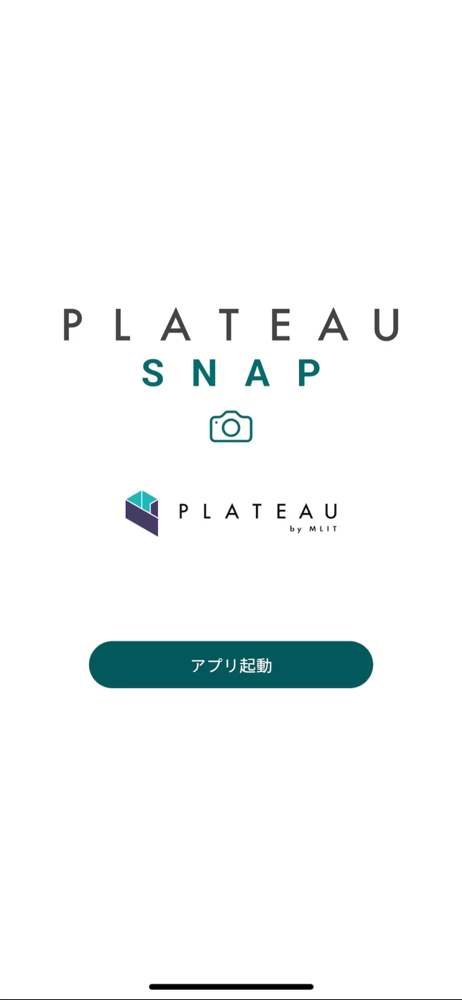
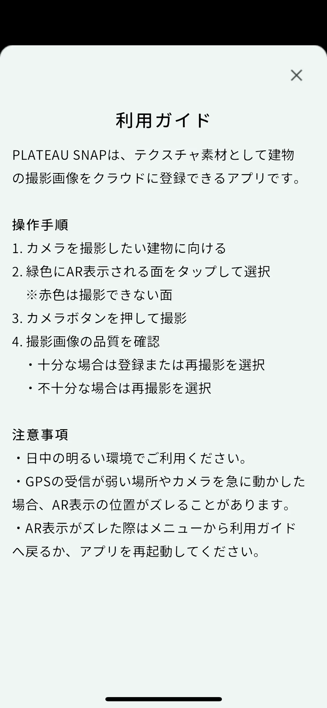
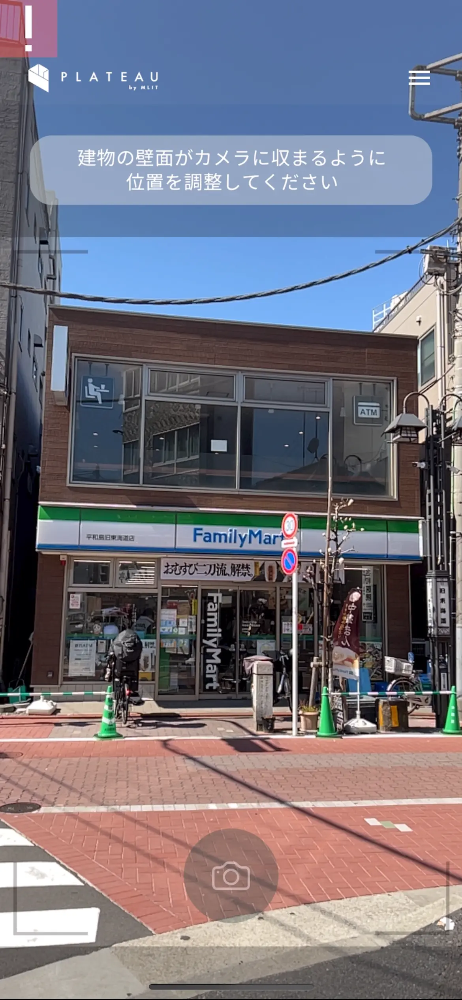
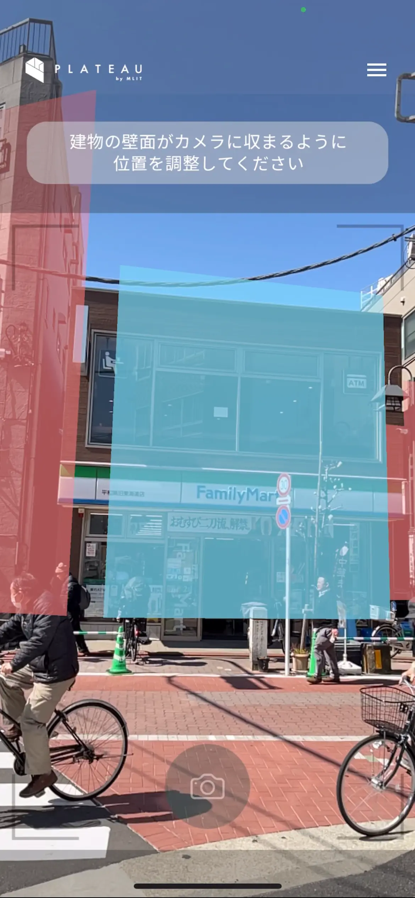
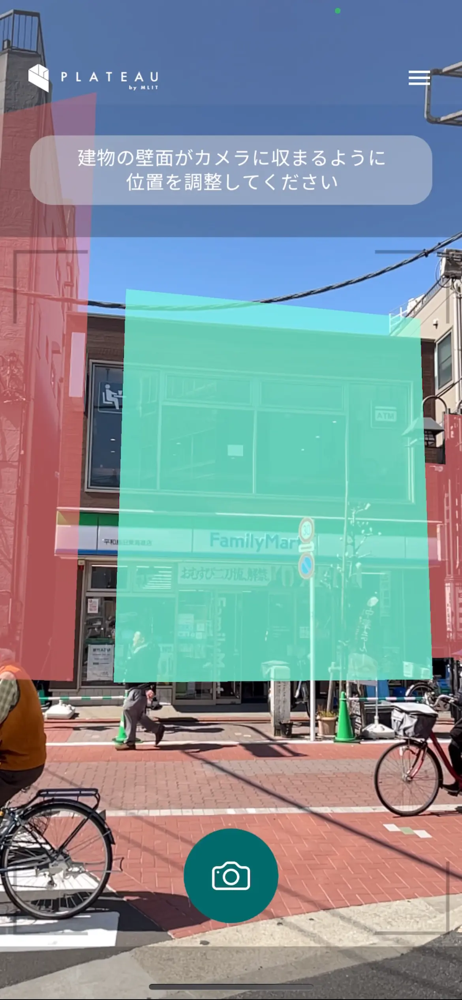
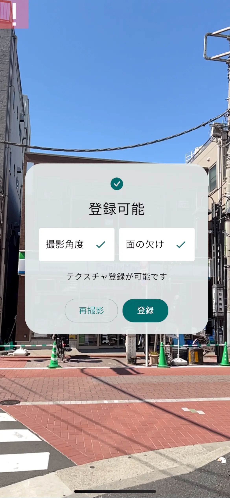
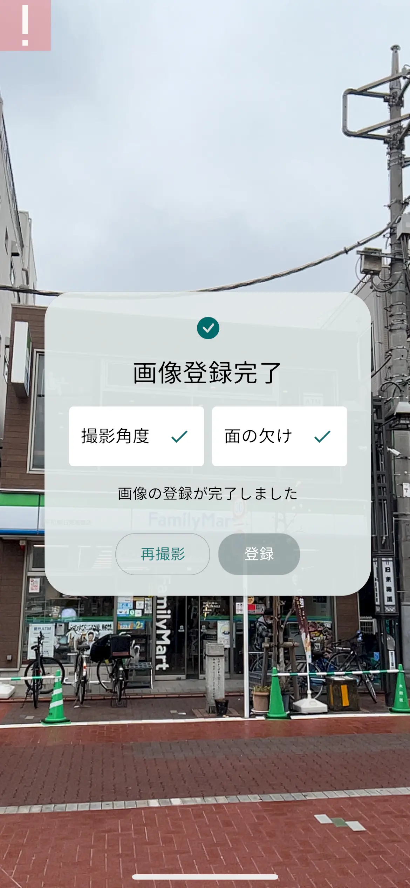

# 1). アプリ利用者向け情報

サンプルアプリの利用者向けの情報です

## 1-1). リポジトリをクローンする

サンプルアプリをビルドして実行するまでの手順です。

- 以下のリポジトリをクローンします
  - [PLATEAU-SNAP-App](https://github.com/Synesthesias/PLATEAU-SNAP-App)

```bash
git clone https://github.com/Synesthesias/PLATEAU-SNAP-App.git
```

## 1-2). アプリのビルド方法

以下のページを参考に各種設定を行ってください

- [ARCoreのAPIキーの設定](<../developer/index.md#arcoreのapiキーの設定方法>)
- [サーバーAPIキーの設定](<../developer/index.md#サーバーのapiキーの設定方法>)

以下のページを参考にアプリをビルドします

- [サンプルアプリのビルド方法](<../developer/index.md#2-9-サンプルアプリのビルド方法>)
- [Xcodeのビルド方法](<../developer/index.md#2-10-xcodeのビルド方法>)

## 1-3). アプリの使い方

### 1-3-1). メイン画面

- アプリを起動すると最初にメイン画面が表示されます
- `アプリ起動` を選択してアプリを開始します



### 1-3-2). 利用ガイド

- アプリが開始されたら利用ガイドが最初に表示されます
- 利用ガイドアプリの使い方を使い方を確認します



---

PLATEAU SNAPは、テクスチャ素材として建物の撮影画像をクラウドに登録できるアプリです。

<b>操作手順</b>
1. カメラを撮影したい建物に向ける
2. 青色にAR表示される面をタップして選択
　※赤色は撮影できない面
3. カメラボタンを押して撮影
4. 撮影画像の品質を確認
    ・十分な場合は登録または再撮影を選択
    ・不十分な場合は再撮影を選択

<b>注意事項</b>
・日中の明るい環境でご利用ください。
・GPSの受信が弱い場所やカメラを急に動かした場合、AR表示の位置がズレることがあります。  
・AR表示がズレた際はメニューから利用ガイドへ戻るか、アプリを再起動してください。

---

- 利用ガイドを確認したら画面右上の閉じるボタンを選択して利用ガイドを閉じます

### 1-3-3). 各種アクセスを許可する

- 利用ガイドを閉じると `建物検出画面` が表示されます
- 初回はカメラへのアクセスを求められるので `OK` を選択します

```plaintext
"snap.sample"がカメラへのアクセスを求めています

建物検出機能に使用します

[許可しない] [OK]
```

- 初回は位置情報の許可を求められるので `Appの使用中は許可` を選択します

```plaintext
"snap.sample"に位置情報の使用を許可しますか？

建物検出機能に使用します

[1度だけ許可]
[Appの使用中は許可]
[許可しない]
```

### 1-3-4). 位置情報の精度を上げる

本アプリはARCoreのGeospatialの仕組みで建物のAR空間上の位置を検出します。

AR空間上の位置情報の精度を上げるために、iPhoneをゆっくり左右に移動しながらカメラで周いの建物を写して下さい。



### 1-3-5). 建物を検出する

位置情報の精度が十分になると、カメラで映している建物に沿って赤や青の面が表示されます。

以下の点に注意してカメラで建物の面を写すと赤色(撮影可能)から青色(撮影できない)に変わります



- 撮影角度
  - 青色(撮影可能): 面に対して正面から撮影できている
  - 赤色(撮影できない): 面に対して斜めから撮影してしまっている
- 面の欠け
  - 青色(撮影可能): 面の全ての頂点がカメラに映っている
  - 赤色(撮影できない): 面の一部または全ての頂点がカメラからはみ出てしまっている

### 1-3-6). 面を選択する

- 前述の手順で青色になった面はタップで選択可能です
- 青色になった面をタップして選択します
- 選択された面は緑色に変わります



### 1-3-7). 撮影する

- 面を選択すると画面下中央の `撮影` ボタンが押せるようになります
- `撮影` ボタンを選択して建物を撮影します

### 1-3-8). 判定する

- `撮影` ボタンで撮影するとダイアログが表示され以下の判定が行われます
- 撮影角度
  - 建物の面が正面から撮影されているか
- 面の欠け
  - 建物の面の頂点が全て画像に含まれている



### 1-3-9). 画像を登録する

- `撮影角度` と `面の欠け` の両方が問題なければ `登録` ボタンが選択できるようになります
- `撮影角度` と `面の欠け` の両方、またはいずれかの条件が満たされていない場合は `再撮影` を選択して再度撮影を行なって下さい
- `登録` ボタンが押せる場合は `登録` ボタンを選択するとサーバーへ撮影した画像が送信され登録されます
- 問題なく送信が完了すると自動的にダイアログが閉じます
- 登録の処理に問題が発生した場合はエラーメッセージが表示されるので再度 `登録` ボタンを選択して下さい



### 1-3-10). 利用ガイドに戻る

- 以上が一連の本サンプルアプリの全体の利用方法の流れです
- 補足として画面右上のメニューボタンを選択すると `利用ガイド` を再度表示することができます
- アプリの調子が悪い場合は一度 `利用ガイド` に戻って撮影を行なってみて下さい
